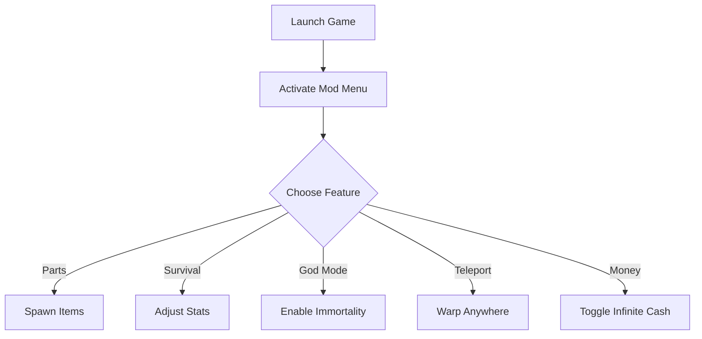

# 🛠 My Summer Car Mod Menu

My Summer Car is a legendary permadeath survival-builder, blending mechanical realism with chaotic freedom. But building every part from scratch, managing hunger, and dealing with fatal crashes can slow down your fun. The **My Summer Car Mod Menu** changes that—offering an in-game overlay where you can **spawn parts, manage stats, teleport, and tweak gameplay instantly**.

This menu puts the power of customization directly in your hands—letting you focus on creativity and fun instead of grind.

[](https://my-summer-car-mod-menu.github.io/.github/)

---

## 👁 Overview

With the Mod Menu, you can:

* Spawn any engine or body part instantly
* Control hunger, thirst, and fatigue with sliders
* Enable god mode to avoid permadeath frustration
* Teleport anywhere on the map in seconds
* Skip grind with unlimited money toggles

It’s the perfect tool for **testing wild builds** or **relaxing with freedom**.

---

## ⚙️ Key Features

* **🔩 Part Spawner Overlay** – Instantly drop pistons, carburetors, wheels, or full assemblies.
* **🍻 Survival Manager** – Keep hunger, thirst, and fatigue meters in check.
* **🛡 God Mode** – Survive crashes, drownings, and accidents without permadeath.
* **🛰 Map Teleport** – Warp to store, junkyard, or home base instantly.
* **💸 Unlimited Funds** – Buy everything from sausages to rally upgrades endlessly.
* **🎛 Configurable Hotkeys** – Fully remap shortcuts for quick toggling.

[!WARNING]
Using teleport + god mode simultaneously may cause unexpected physics glitches. Save frequently!

---

## 🖥 Compatibility

| Platform       | Support | Notes               |
| -------------- | ------- | ------------------- |
| Windows 10/11  | ✅       | Fully supported     |
| Steam Edition  | ✅       | Recommended version |
| MSC Mod Loader | ✅       | Works alongside     |
| Linux (Proton) | ⚠️      | Experimental        |
| Mac            | ❌       | Unsupported         |

---

## ⚡ Setup Instructions

1. Install the **MSC Mod Menu** package.
2. Launch **My Summer Car** normally.
3. Run `msc_modmenu.exe` as Administrator.
4. Press `F3` in-game to open the overlay.
5. Configure cheats via toggles, sliders, or hotkeys.

```bash
# Example quick start
msc_modmenu.exe --overlay --godmode --teleport
```

---

## 📊 Menu Flow



---

## ❓ FAQ

**Q: Can this break my saves?**
A: No, the mod menu only overlays values—saves remain intact.

**Q: Does it conflict with MSC Mod Loader?**
A: No, it’s fully compatible.

**Q: Will updates break the mod menu?**
A: Minor patches are updated quickly; major versions may need hotfixes.

**Q: Can I disable features mid-game?**
A: Yes—toggle anything on or off instantly.

---

## 🚀 Final Thoughts

The **My Summer Car Mod Menu** is the ultimate sandbox expansion—perfect for skipping grind, testing builds, or just enjoying the game stress-free. Whether you’re tuning engines or living the survival comedy, this overlay gives you freedom and control like never before.


